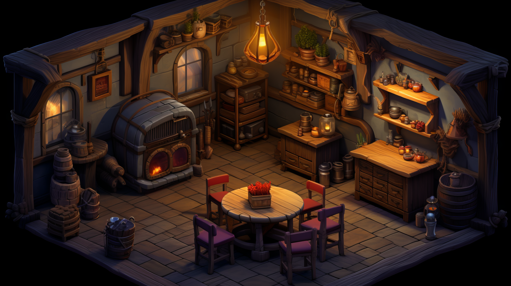
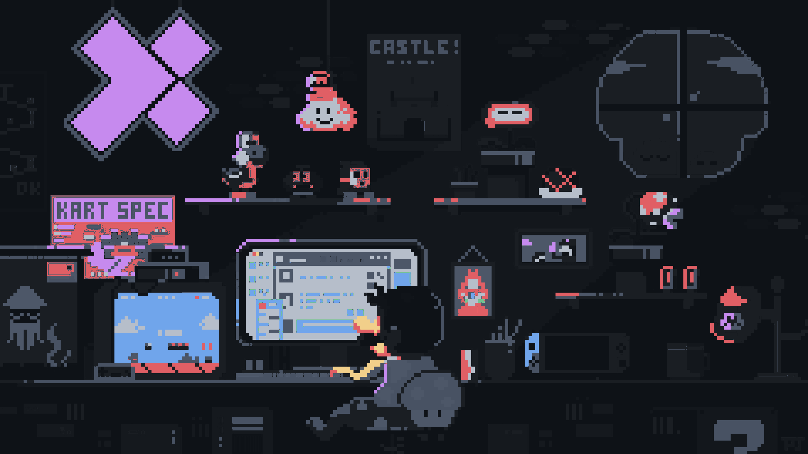
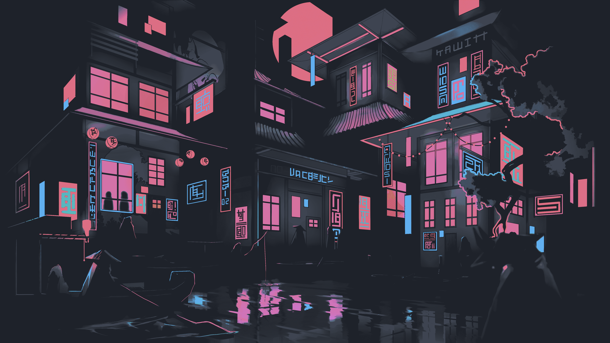

> **Yes! Literally the best wallpapers known to man.**
> I know. Enjoy.🐐


## How to download or clone 👀

### Clone it

Since this repo contains high-res assets, it is heavy. I recommend a **shallow clone** to save time and disk space (skips the git history):

```bash
git clone --depth 1 https://github.com/Brian-Zavala/favorite-wallpapers.git
cd favorite-wallpapers
```

### [**OR JUST DOWNLOAD ZIP FILE**](https://github.com/Brian-Zavala/favorite-wallpapers/archive/refs/heads/main.zip)

<!-- GALLERY -->
<table>
  <tr>
    <td align="center" valign="top">
      <a href="Anime-City-Night.webp">
        
      </a>
      <br />
      <sub>Anime-City-Night.webp</sub>
    </td>
    <td align="center" valign="top">
      <a href="Anime-Room.webp">
        
      </a>
      <br />
      <sub>Anime-Room.webp</sub>
    </td>
    <td align="center" valign="top">
      <a href="Balcony-ja.webp">
        
      </a>
      <br />
      <sub>Balcony-ja.webp</sub>
    </td>
  </tr>
  <tr>
    <td align="center" valign="top">
      <a href="City-Rainy-Night.webp">
        
      </a>
      <br />
      <sub>City-Rainy-Night.webp</sub>
    </td>
    <td align="center" valign="top">
      <a href="Fantasy-Landscape2.webp">
        
      </a>
      <br />
      <sub>Fantasy-Landscape2.webp</sub>
    </td>
    <td align="center" valign="top">
      <a href="Fantasy-Medieval_Travern.webp">
        
      </a>
      <br />
      <sub>Fantasy-Medieval_Travern.webp</sub>
    </td>
  </tr>
  <tr>
    <td align="center" valign="top">
      <a href="Garage.webp">
        
      </a>
      <br />
      <sub>Garage.webp</sub>
    </td>
    <td align="center" valign="top">
      <a href="IT_guy.webp">
        
      </a>
      <br />
      <sub>IT_guy.webp</sub>
    </td>
    <td align="center" valign="top">
      <a href="Linux-user-Room.webp">
        
      </a>
      <br />
      <sub>Linux-user-Room.webp</sub>
    </td>
  </tr>
  <tr>
    <td align="center" valign="top">
      <a href="Lofi-Computer.webp">
        
      </a>
      <br />
      <sub>Lofi-Computer.webp</sub>
    </td>
    <td align="center" valign="top">
      <a href="Lofi-Desktop-Man-Studying.webp">
        
      </a>
      <br />
      <sub>Lofi-Desktop-Man-Studying.webp</sub>
    </td>
    <td align="center" valign="top">
      <a href="Lofi-Room.webp">
        
      </a>
      <br />
      <sub>Lofi-Room.webp</sub>
    </td>
  </tr>
  <tr>
    <td align="center" valign="top">
      <a href="Lofi-Urban-Nightscape.webp">
        
      </a>
      <br />
      <sub>Lofi-Urban-Nightscape.webp</sub>
    </td>
    <td align="center" valign="top">
      <a href="Lofi_Cat.webp">
        
      </a>
      <br />
      <sub>Lofi_Cat.webp</sub>
    </td>
    <td align="center" valign="top">
      <a href="Night%20monochrome.jpg">
        
      </a>
      <br />
      <sub>Night monochrome.jpg</sub>
    </td>
  </tr>
  <tr>
    <td align="center" valign="top">
      <a href="Northern%20Lights5.jpg">
        
      </a>
      <br />
      <sub>Northern Lights5.jpg</sub>
    </td>
    <td align="center" valign="top">
      <a href="Pastel-Window.webp">
        
      </a>
      <br />
      <sub>Pastel-Window.webp</sub>
    </td>
    <td align="center" valign="top">
      <a href="Relaxed_Mario.webp">
        
      </a>
      <br />
      <sub>Relaxed_Mario.webp</sub>
    </td>
  </tr>
  <tr>
    <td align="center" valign="top">
      <a href="Retro%20-%20Programmer.webp">
        
      </a>
      <br />
      <sub>Retro - Programmer.webp</sub>
    </td>
    <td align="center" valign="top">
      <a href="Space-Nebula.webp">
        
      </a>
      <br />
      <sub>Space-Nebula.webp</sub>
    </td>
    <td align="center" valign="top">
      <a href="Sun-Setting-Horizon.png">
        
      </a>
      <br />
      <sub>Sun-Setting-Horizon.png</sub>
    </td>
  </tr>
  <tr>
    <td align="center" valign="top">
      <a href="Techno-Geek.webp">
        
      </a>
      <br />
      <sub>Techno-Geek.webp</sub>
    </td>
    <td align="center" valign="top">
      <a href="Wet-Road.jpg">
        
      </a>
      <br />
      <sub>Wet-Road.jpg</sub>
    </td>
    <td align="center" valign="top">
      <a href="a_black_and_white_drawing_of_a_man_with_his_mouth_open.webp">
        
      </a>
      <br />
      <sub>a_black_and_white_drawing_of_a_man_with_his_mouth_open.webp</sub>
    </td>
  </tr>
  <tr>
    <td align="center" valign="top">
      <a href="a_black_and_white_image_of_a_zombie.webp">
        
      </a>
      <br />
      <sub>a_black_and_white_image_of_a_zombie.webp</sub>
    </td>
    <td align="center" valign="top">
      <a href="a_cartoon_of_a_robot_with_a_red_background.jpg">
        
      </a>
      <br />
      <sub>a_cartoon_of_a_robot_with_a_red_background.jpg</sub>
    </td>
    <td align="center" valign="top">
      <a href="a_cartoon_of_a_woman_standing_next_to_a_car.jpg">
        
      </a>
      <br />
      <sub>a_cartoon_of_a_woman_standing_next_to_a_car.jpg</sub>
    </td>
  </tr>
  <tr>
    <td align="center" valign="top">
      <a href="a_cartoon_of_a_woman_with_glasses.png">
        
      </a>
      <br />
      <sub>a_cartoon_of_a_woman_with_glasses.png</sub>
    </td>
    <td align="center" valign="top">
      <a href="a_cartoon_of_a_woman_with_her_hands_on_her_face.webp">
        
      </a>
      <br />
      <sub>a_cartoon_of_a_woman_with_her_hands_on_her_face.webp</sub>
    </td>
    <td align="center" valign="top">
      <a href="a_group_of_black_wolves_with_red_eyes.webp">
        
      </a>
      <br />
      <sub>a_group_of_black_wolves_with_red_eyes.webp</sub>
    </td>
  </tr>
  <tr>
    <td align="center" valign="top">
      <a href="a_group_of_men_standing_on_a_beach.webp">
        
      </a>
      <br />
      <sub>a_group_of_men_standing_on_a_beach.webp</sub>
    </td>
    <td align="center" valign="top">
      <a href="a_man_standing_in_a_dark_place_with_a_large_circle_of_light.jpg">
        
      </a>
      <br />
      <sub>a_man_standing_in_a_dark_place_with_a_large_circle_of_light.jpg</sub>
    </td>
    <td align="center" valign="top">
      <a href="a_person_walking_on_a_road_with_power_lines_and_wires.png">
        
      </a>
      <br />
      <sub>a_person_walking_on_a_road_with_power_lines_and_wires.png</sub>
    </td>
  </tr>
  <tr>
    <td align="center" valign="top">
      <a href="a_road_leading_to_a_body_of_water.png">
        
      </a>
      <br />
      <sub>a_road_leading_to_a_body_of_water.png</sub>
    </td>
    <td align="center" valign="top">
      <a href="a_road_with_power_lines_and_power_lines.png">
        
      </a>
      <br />
      <sub>a_road_with_power_lines_and_power_lines.png</sub>
    </td>
    <td align="center" valign="top">
      <a href="a_woman_standing_on_a_road_with_sunflowers.webp">
        
      </a>
      <br />
      <sub>a_woman_standing_on_a_road_with_sunflowers.webp</sub>
    </td>
  </tr>
  <tr>
    <td align="center" valign="top">
      <a href="afterglow.webp">
        
      </a>
      <br />
      <sub>afterglow.webp</sub>
    </td>
    <td align="center" valign="top">
      <a href="arch-linux-sound-bars.webp">
        
      </a>
      <br />
      <sub>arch-linux-sound-bars.webp</sub>
    </td>
    <td align="center" valign="top">
      <a href="arch-windows.png">
        
      </a>
      <br />
      <sub>arch-windows.png</sub>
    </td>
  </tr>
  <tr>
    <td align="center" valign="top">
      <a href="astronaut.webp">
        
      </a>
      <br />
      <sub>astronaut.webp</sub>
    </td>
    <td align="center" valign="top">
      <a href="astronaut2.webp">
        
      </a>
      <br />
      <sub>astronaut2.webp</sub>
    </td>
    <td align="center" valign="top">
      <a href="black-geo-arch.webp">
        
      </a>
      <br />
      <sub>black-geo-arch.webp</sub>
    </td>
  </tr>
  <tr>
    <td align="center" valign="top">
      <a href="blackhole-spaceman.png">
        
      </a>
      <br />
      <sub>blackhole-spaceman.png</sub>
    </td>
    <td align="center" valign="top">
      <a href="boy-wonder.webp">
        
      </a>
      <br />
      <sub>boy-wonder.webp</sub>
    </td>
    <td align="center" valign="top">
      <a href="candles.webp">
        
      </a>
      <br />
      <sub>candles.webp</sub>
    </td>
  </tr>
  <tr>
    <td align="center" valign="top">
      <a href="car_on_mars.webp">
        
      </a>
      <br />
      <sub>car_on_mars.webp</sub>
    </td>
    <td align="center" valign="top">
      <a href="catching-the-desert.webp">
        
      </a>
      <br />
      <sub>catching-the-desert.webp</sub>
    </td>
    <td align="center" valign="top">
      <a href="chinese_arch.png">
        
      </a>
      <br />
      <sub>chinese_arch.png</sub>
    </td>
  </tr>
  <tr>
    <td align="center" valign="top">
      <a href="colorful-arch.webp">
        
      </a>
      <br />
      <sub>colorful-arch.webp</sub>
    </td>
    <td align="center" valign="top">
      <a href="cyberpunk-man-arch.webp">
        
      </a>
      <br />
      <sub>cyberpunk-man-arch.webp</sub>
    </td>
    <td align="center" valign="top">
      <a href="dragon-ball-z-goku-4k-wallpapers.jpg">
        
      </a>
      <br />
      <sub>dragon-ball-z-goku-4k-wallpapers.jpg</sub>
    </td>
  </tr>
  <tr>
    <td align="center" valign="top">
      <a href="dunes-sun.webp">
        
      </a>
      <br />
      <sub>dunes-sun.webp</sub>
    </td>
    <td align="center" valign="top">
      <a href="elliot-mr-robot.jpg">
        
      </a>
      <br />
      <sub>elliot-mr-robot.jpg</sub>
    </td>
    <td align="center" valign="top">
      <a href="elliot_and_joe_rogan.png">
        
      </a>
      <br />
      <sub>elliot_and_joe_rogan.png</sub>
    </td>
  </tr>
  <tr>
    <td align="center" valign="top">
      <a href="elon_and_trump_smoking.png">
        
      </a>
      <br />
      <sub>elon_and_trump_smoking.png</sub>
    </td>
    <td align="center" valign="top">
      <a href="explorer_green_day.webp">
        
      </a>
      <br />
      <sub>explorer_green_day.webp</sub>
    </td>
    <td align="center" valign="top">
      <a href="fairytale-castle.png">
        
      </a>
      <br />
      <sub>fairytale-castle.png</sub>
    </td>
  </tr>
  <tr>
    <td align="center" valign="top">
      <a href="fantasy-mountain.webp">
        
      </a>
      <br />
      <sub>fantasy-mountain.webp</sub>
    </td>
    <td align="center" valign="top">
      <a href="flying-nimbus-and-goku.webp">
        
      </a>
      <br />
      <sub>flying-nimbus-and-goku.webp</sub>
    </td>
    <td align="center" valign="top">
      <a href="galaxy-tux.webp">
        
      </a>
      <br />
      <sub>galaxy-tux.webp</sub>
    </td>
  </tr>
  <tr>
    <td align="center" valign="top">
      <a href="galaxy-waves.jpg">
        
      </a>
      <br />
      <sub>galaxy-waves.jpg</sub>
    </td>
    <td align="center" valign="top">
      <a href="game-of-thrones.jpg">
        
      </a>
      <br />
      <sub>game-of-thrones.jpg</sub>
    </td>
    <td align="center" valign="top">
      <a href="goku-new-form-wallpapers.jpg">
        
      </a>
      <br />
      <sub>goku-new-form-wallpapers.jpg</sub>
    </td>
  </tr>
  <tr>
    <td align="center" valign="top">
      <a href="groot_dark.webp">
        
      </a>
      <br />
      <sub>groot_dark.webp</sub>
    </td>
    <td align="center" valign="top">
      <a href="hollow-knight.jpg">
        
      </a>
      <br />
      <sub>hollow-knight.jpg</sub>
    </td>
    <td align="center" valign="top">
      <a href="honkadaloonga.webp">
        
      </a>
      <br />
      <sub>honkadaloonga.webp</sub>
    </td>
  </tr>
  <tr>
    <td align="center" valign="top">
      <a href="hyprland.webp">
        
      </a>
      <br />
      <sub>hyprland.webp</sub>
    </td>
    <td align="center" valign="top">
      <a href="japanese-cyberpunk.png">
        
      </a>
      <br />
      <sub>japanese-cyberpunk.png</sub>
    </td>
    <td align="center" valign="top">
      <a href="kame_house.webp">
        
      </a>
      <br />
      <sub>kame_house.webp</sub>
    </td>
  </tr>
  <tr>
    <td align="center" valign="top">
      <a href="kath.webp">
        
      </a>
      <br />
      <sub>kath.webp</sub>
    </td>
    <td align="center" valign="top">
      <a href="linux-tux-reflection.webp">
        
      </a>
      <br />
      <sub>linux-tux-reflection.webp</sub>
    </td>
    <td align="center" valign="top">
      <a href="linux-tux-wallpaper.webp">
        
      </a>
      <br />
      <sub>linux-tux-wallpaper.webp</sub>
    </td>
  </tr>
  <tr>
    <td align="center" valign="top">
      <a href="matrix-pill-wallpapers.jpg">
        
      </a>
      <br />
      <sub>matrix-pill-wallpapers.jpg</sub>
    </td>
    <td align="center" valign="top">
      <a href="matrix.jpg">
        
      </a>
      <br />
      <sub>matrix.jpg</sub>
    </td>
    <td align="center" valign="top">
      <a href="mr-robot-one-or-zero.png">
        
      </a>
      <br />
      <sub>mr-robot-one-or-zero.png</sub>
    </td>
  </tr>
  <tr>
    <td align="center" valign="top">
      <a href="mr.robot-joe-rogan.png">
        
      </a>
      <br />
      <sub>mr.robot-joe-rogan.png</sub>
    </td>
    <td align="center" valign="top">
      <a href="muscle-car-ice-road-red-moon.webp">
        
      </a>
      <br />
      <sub>muscle-car-ice-road-red-moon.webp</sub>
    </td>
    <td align="center" valign="top">
      <a href="mystical-night-in-town.webp">
        
      </a>
      <br />
      <sub>mystical-night-in-town.webp</sub>
    </td>
  </tr>
  <tr>
    <td align="center" valign="top">
      <a href="nature.webp">
        
      </a>
      <br />
      <sub>nature.webp</sub>
    </td>
    <td align="center" valign="top">
      <a href="new-worlds.webp">
        
      </a>
      <br />
      <sub>new-worlds.webp</sub>
    </td>
    <td align="center" valign="top">
      <a href="retro-linux.webp">
        
      </a>
      <br />
      <sub>retro-linux.webp</sub>
    </td>
  </tr>
  <tr>
    <td align="center" valign="top">
      <a href="space-city.webp">
        
      </a>
      <br />
      <sub>space-city.webp</sub>
    </td>
    <td align="center" valign="top">
      <a href="stranger-things-season-5.jpg">
        
      </a>
      <br />
      <sub>stranger-things-season-5.jpg</sub>
    </td>
    <td align="center" valign="top">
      <a href="stranger_things_group.jpg">
        
      </a>
      <br />
      <sub>stranger_things_group.jpg</sub>
    </td>
  </tr>
  <tr>
    <td align="center" valign="top">
      <a href="stranger_things_title.png">
        
      </a>
      <br />
      <sub>stranger_things_title.png</sub>
    </td>
    <td align="center" valign="top">
      <a href="sunset-mountain-beautiful.webp">
        
      </a>
      <br />
      <sub>sunset-mountain-beautiful.webp</sub>
    </td>
    <td align="center" valign="top">
      <a href="tron-ares.webp">
        
      </a>
      <br />
      <sub>tron-ares.webp</sub>
    </td>
  </tr>
  <tr>
    <td align="center" valign="top">
      <a href="tux_drinking.webp">
        
      </a>
      <br />
      <sub>tux_drinking.webp</sub>
    </td>
    <td align="center" valign="top">
      <a href="we-are-anonymous.png">
        
      </a>
      <br />
      <sub>we-are-anonymous.png</sub>
    </td>
    <td align="center" valign="top">
      <a href="winter-is-here.webp">
        
      </a>
      <br />
      <sub>winter-is-here.webp</sub>
    </td>
  </tr>
</table>
